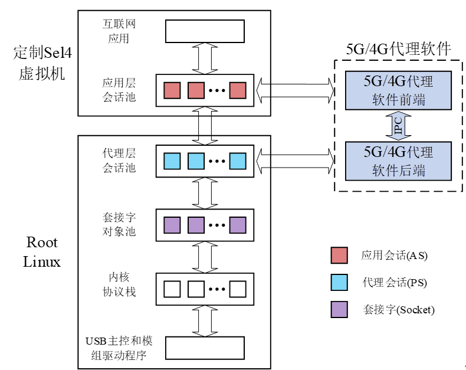

    

### 总体方案
客户虚机与Root Linux通过虚拟机间共享内存通信，在驱动层直接复用Linux已有驱动，例如5G/4G模组驱动、USB主控驱动，同时复用Linux内核网络协议栈处理网络数据包。在Root Linux用户态和客户虚拟机运行本网络代理软件，进行数据包的转发，结构如下图所示：
      

代理软件分为前端和后端，分别部署在客户虚拟机和Root Linux，两者通过虚拟机间共享内存通信。前端为应用提供新建连接/节点对象、关闭连接/节点对象、发送数据和接收数据接口，各接口具体功能的实现则放在代理软件的后端。同时，前端维护一个应用层会话池，用于存储会话对象。当应用通过前端提供的API成功新建连接时，会获得一个指向会话的句柄，通过关闭连接API，则可以回收其所占用的资源。后端则部署在Root Linux上，其维护一个代理会话池，会话池中的对象被称为代理会话，这些代理会话与前端会话池中的会话对象一一对应。代理会话池同时与套接字对象池对接，从而打通前端、后端和Socket数据传输链路。